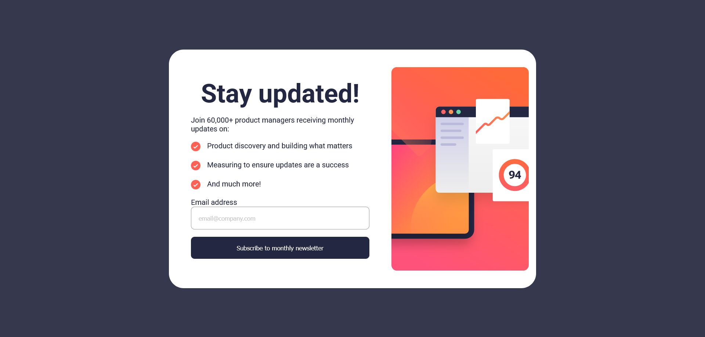

# Frontend Mentor - Newsletter sign-up form with success message solution

This is a solution to the [Newsletter sign-up form with success message challenge on Frontend Mentor](https://www.frontendmentor.io/challenges/newsletter-signup-form-with-success-message-3FC1AZbNrv).

## Table of contents

- [Overview](#overview)
  - [The challenge](#the-challenge)
  - [Screenshot](#screenshot)
  - [Links](#links)
- [My process](#my-process)
  - [Built with](#built-with)
  - [What I learned](#what-i-learned)
  - [Useful resources](#useful-resources)
- [Author](#author)
- [Acknowledgments](#acknowledgments)

## Overview

### The challenge

Users should be able to:

- Add their email and submit the form
- See a success message with their email after successfully submitting the form
- See form validation messages if:
  - The field is left empty
  - The email address is not formatted correctly
- View the optimal layout for the interface depending on their device's screen size
- See hover and focus states for all interactive elements on the page

### Screenshot

### Links

- Solution URL: [Add solution URL here](https://github.com/mod-prashant/Newsletter-sign-up-form-with-success-message)
- Live Site URL: [Add live site URL here](https://newsletter-sign-up-form-with-success-message-hazel.vercel.app/)

## My process

### Built with

- Semantic HTML5 markup
- CSS custom properties
- Flexbox
- JavaScript

### What I learned

During this project, I refined my skills in using CSS Grid and flex box for creating responsive layouts. I also improved my JavaScript

### Useful resources

- [w3schools](https://www.w3schools.com/) - A comprehensive resource for web development best practices and references.

## Author

- Portfolio - [Prashant Uniyal](https://resume8305.wordpress.com/)
- Frontend Mentor Profile - [@mod-prashant](https://www.frontendmentor.io/profile/mod-prashant)
- LinkedIn - [Prashant Uniyal](https://linkedin.com/in/prashant-uniyal-9ab235273/)

## Acknowledgments

I would like to thank the Frontend Mentor for providing this great learning opportunity and Frontend Mentor community for professional feedbacks.